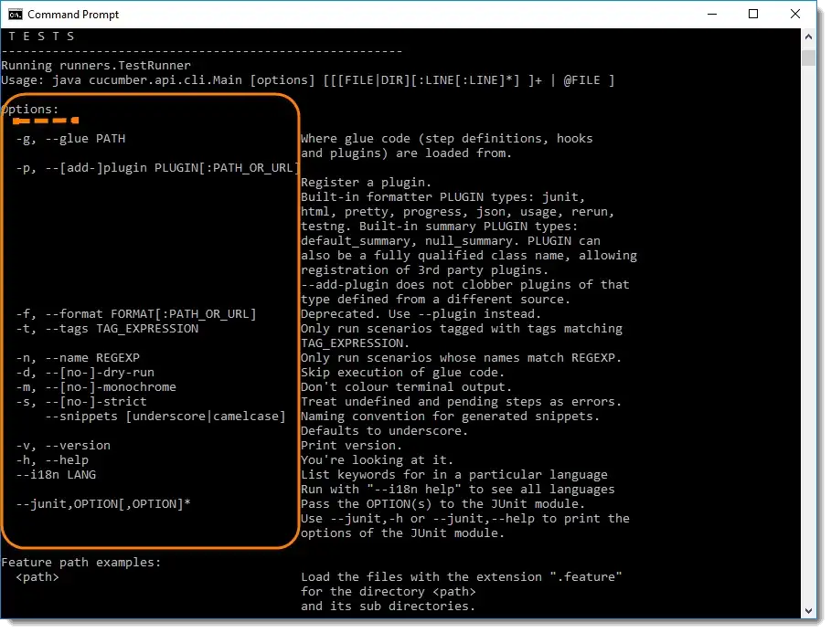

# SeleniumMavenBDDCucumber

#Maven Commands

mvn clean test -Dcucumber.filter.tags="@D_3_S_1" -Ddataproviderthreadcount="1" --log-file log.txt

mvn clean test -Dcucumber.filter.tags="@D_3_S_1" -Dcucumber.filter.dryRun=true -Ddataproviderthreadcount="1" --log-file log.txt

mvn clean test -Dcucumber.filter.tags="@D_3_S_1" --dry-run -Ddataproviderthreadcount="1" --log-file log.txt

mvn clean test -Dcucumber.filter.tags="@D_3_S_1" -Dcucumber.options=“-d” -Ddataproviderthreadcount="1" --log-file log.txt

mvn clean test -Dcucumber.filter.tags="@D_3_S_1" -Dcucumber.options=“--[yes-]-dry-run” -Ddataproviderthreadcount="1" --log-file log.txt

mvn clean test -Dcucumber.filter.tags="@D_3_S_1" -Dcucumber.options=“--dry-run true” -Ddataproviderthreadcount="1" --log-file log.txt

mvn clean test -Dcucumber.filter.tags="@D_3_S_1" -Dcucumber.options=“--dry-run true” -Ddataproviderthreadcount="1" --log-file log.json

lighthouse https://www.flexshares.com/gb/en/individual --output html --chrome-flags=”--headless” --output-path="C:\Users\govreddy\Desktop\Internal\lighthouse.html"

lighthouse https://www.flexshares.com/gb/en/individual --chrome-flags=”--headless” --chrome-flags="--window-size=1920,1080"

lighthouse https://www.flexshares.com/gb/en/individual --output csv

npm i -g lighthouse-batch-parallel

